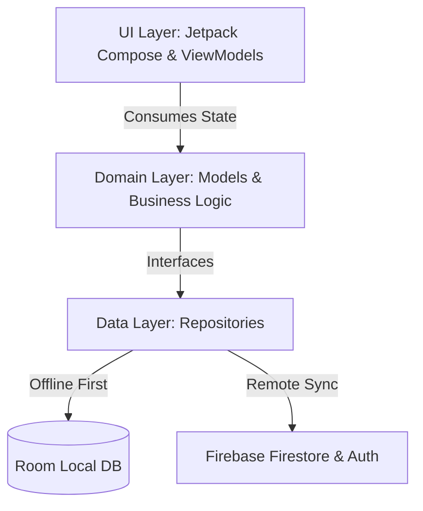

# ✈️ Airline Online Check-In & Flight Management App

[](https://kotlinlang.org/)
[](https://developer.android.com/jetpack/compose)
[](https://m3.material.io/)
[](https://firebase.google.com/)
[](https://developer.android.com/training/data-storage/room)
[](https://developer.android.com/training/dependency-injection/hilt-android)
[](https://www.docker.com/)

A modern, production-grade Android application and background service ecosystem designed for seamless airline booking management, online passenger check-in, dynamic seat selection, and offline-first boarding pass access.

Built using **Kotlin**, **Jetpack Compose (Material 3)**, **Clean Architecture**, **MVVM**, **Firebase**, **Room DB**, and a **Node.js Docker Background Service**.

---

## 🌟 Key Features

### 📱 Android Application
* **🔐 Authentication & Onboarding**: Interactive walkthrough onboarding, Firebase Authentication supporting Email/Password and Google Sign-In, and user profile management.
* **🔍 Flight Search & Booking Lookup**: Search flights by origin, destination, and departure dates, or instantly look up existing reservations using a booking reference code and passenger last name.
* **💺 Dynamic Interactive Seat Selection**: Visual seat grid mapping with cabin class breakdown (`BUSINESS`, `PREMIUM`, `ECONOMY`), real-time seat availability updates, and automatic pricing calculation per seat type.
* **👥 Passenger & Document Management**: Support for multi-passenger bookings, saved traveler profiles, and secure document management (passports and ID details).
* **🎫 Offline-First Boarding Passes**: Automatic local caching via **Room Database**, allowing travelers to view boarding pass details and high-resolution **ZXing QR codes** even without network connectivity.
* **📄 PDF Pass Exporting**: Direct rendering and export of official boarding passes to printable PDF documents.
* **🆘 Help Center & Support**: Built-in support screen with FAQs, travel guidance, and airline service policies.

### 🐳 Background Generator Worker (`flight-worker`)
* **🌱 Automated Airport Seeding**: Automatically populates Firestore `airports` collection using structured airport dataset.
* **📅 Dynamic Schedule Generation**: Automated Node.js cron service running via Docker to generate realistic flight schedules for dates 3–10 days ahead.
* **💺 Seat Allocation Engine**: Instantly initializes complete seat maps per generated flight with proper cabin layouts.

---

## 🛠️ Tech Stack & Architecture

| Layer / Category | Technology / Library | Purpose |
| :--- | :--- | :--- |
| **Language** | Kotlin (JDK 17) | Core Android Application Language |
| **UI Framework** | Jetpack Compose + Material 3 | Declarative UI & Modern Android Design Tokens |
| **Architecture** | MVVM + Clean Architecture | Strict separation of Concerns (Data, Domain, UI) |
| **Dependency Injection** | Dagger Hilt (KSP) | Compile-time dependency injection across ViewModels & Repositories |
| **Backend & Auth** | Firebase (Auth, Firestore, Storage) | Cloud user management, real-time data sync, image storage |
| **Local Database** | Room DB + DataStore | Offline caching of bookings, passes, and user preferences |
| **Asynchronous Logic** | Kotlin Coroutines & StateFlow | Reactive, non-blocking UI state management |
| **Navigation** | Jetpack Navigation Compose | Type-safe single-activity declarative screen routing |
| **QR Code & Graphics** | ZXing Core | Dynamic barcode/QR code generation for boarding passes |
| **Background Worker** | Node.js, Firebase Admin SDK, Docker | VM-hosted container service for flight schedule generation |

---

## 📐 Architecture Overview

The app follows **Clean Architecture** principles structured into 3 core layers:



* **UI Layer (`com.airline.checkin.ui`)**: Declarative screens powered by Jetpack Compose components. ViewModels expose immutable `StateFlow` states for rendering.
* **Domain Layer (`com.airline.checkin.domain`)**: Pure Kotlin domain models describing domain entities (`Booking`, `Flight`, `Passenger`, `BoardingPass`, `Seat`).
* **Data Layer (`com.airline.checkin.data`)**: Repository implementations handling offline-first logic: data is served locally from Room DB while synchronizing with Firebase Firestore in the background.

---

## 📁 Repository Structure

```text
airline-checkin-app/
├── app/                                    # Android Mobile Application
│   ├── src/main/java/com/airline/checkin/
│   │   ├── data/                           # Data layer
│   │   │   ├── local/                      # Room Database (DAOs, Entities, AppDatabase)
│   │   │   ├── remote/                     # Firebase Services (Auth, Firestore)
│   │   │   └── repository/                 # Repository implementations (Sync logic)
│   │   ├── di/                             # Hilt DI Modules (AppModule, DatabaseModule, etc.)
│   │   ├── domain/                         # Business Domain models
│   │   ├── ui/                             # Jetpack Compose Screens & ViewModels
│   │   │   ├── auth/                       # Login, Register, Complete Profile
│   │   │   ├── boardingpass/               # Boarding pass view & PDF export
│   │   │   ├── checkin/                    # Booking lookup, passenger select, check-in flow
│   │   │   ├── helpcenter/                 # FAQs & Customer Support
│   │   │   ├── home/                       # Flight search dashboard & results
│   │   │   ├── onboarding/                 # App introduction carousel
│   │   │   ├── profile/                    # User profile & saved documents
│   │   │   └── seat/                       # Interactive graphical seat map
│   │   └── MainActivity.kt                 # Application Entry Point
│   └── build.gradle.kts                    # App-level build configuration
│
├── flight-worker/                          # Background Worker Service (Docker)
│   ├── data/airports.json                  # Seed data for international airports
│   ├── index.js                            # Generator engine using Firebase Admin SDK
│   ├── Dockerfile                          # Production container build definition
│   ├── docker-compose.worker.yml           # Docker Compose service configuration
│   └── README.md                           # Detailed worker deployment guide
│
├── scripts/                                # Database schemas & reference documentation
├── build.gradle.kts                        # Root Gradle build script
├── settings.gradle.kts                     # Gradle project settings
└── README.md                               # Project documentation
```

---

## 🚀 Getting Started

### Android Application Setup

#### Prerequisites
* **Android Studio**: Ladybug / Hedgehog or newer.
* **JDK**: Version 17.
* **Android SDK**: API 26 (Android 8.0 Oreo) minimum, target API 35.

#### Instructions
1. **Clone the Repository**
   ```bash
   git clone https://github.com/SariYanouche/airline-checkin-app.git
   cd airline-checkin-app
   ```

2. **Configure Firebase**
   - Create a project on the [Firebase Console](https://console.firebase.google.com).
   - Add an Android app with package name `com.airline.checkin`.
   - Download `google-services.json` and place it into the `app/` folder (`airline-checkin-app/app/google-services.json`).
   - Enable **Firebase Authentication** (Email/Password & Google Sign-In) and **Cloud Firestore**.

3. **Build & Run**
   - Open the project in Android Studio.
   - Wait for Gradle sync to complete.
   - Select an emulator or connected device (API 26+) and press **Run (Shift + F10)**.

---

## 🐳 Flight Generator Background Worker Setup

The `flight-worker` is a containerized background service that runs on a VM or server. It automatically seeds airport data into Firestore and generates daily flight schedules with available seat configurations.

### Requirements & Quick Start
1. Navigate to the worker directory:
   ```bash
   cd flight-worker
   ```
2. Place your Firebase Admin SDK service account key at `flight-worker/secrets/serviceAccount.json`.
3. Launch via Docker Compose:
   ```bash
   docker compose -f docker-compose.worker.yml run --rm flight-worker
   ```
4. Refer to [flight-worker/README.md](file:///d:/temp/airline-checkin-app/flight-worker/README.md) for automated Cron configuration and environment variable details.

---

## 📊 Database Schema Summary

| Firestore Collection | Description | Primary Fields |
| :--- | :--- | :--- |
| `airports` | Global airport metadata | `code`, `name`, `city`, `country` |
| `flights` | Scheduled flight entries | `flightNumber`, `origin`, `destination`, `departureTime`, `arrivalTime`, `price`, `aircraftType` |
| `seats` | Flight seat layout & status | `flightId`, `seatNumber`, `type` (`BUSINESS`/`PREMIUM`/`ECONOMY`), `isOccupied` |
| `bookings` | Customer ticket reservations | `bookingReference`, `userId`, `flightId`, `passengerIds`, `status`, `totalPrice` |
| `passengers` | Saved traveler profiles | `firstName`, `lastName`, `passportNumber`, `nationality`, `dateOfBirth` |

